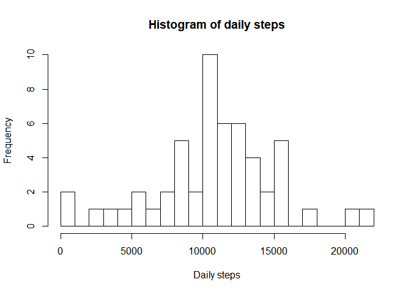
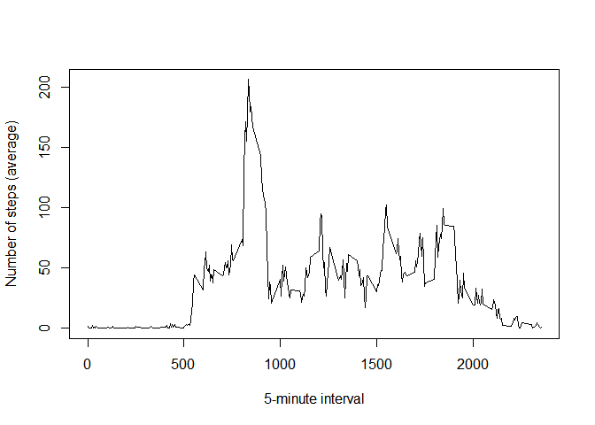
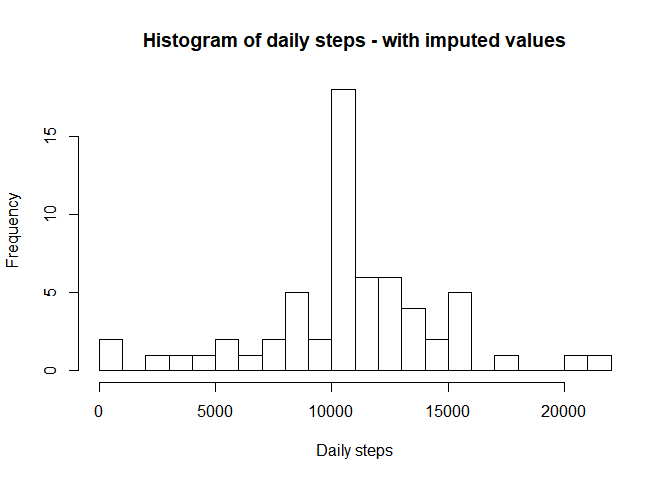
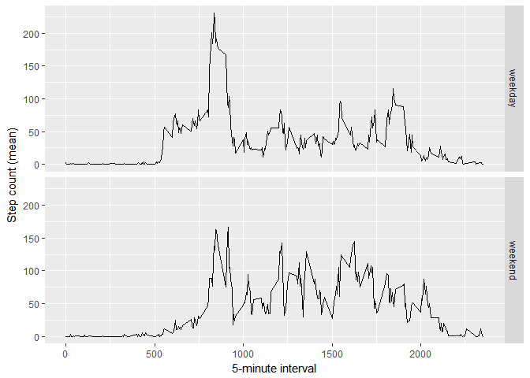

Theodor Stenevang Klemming


```r
library(here)
library(readr)
library(dplyr)
library(ggplot2)
```

## Loading and preprocessing the data

```r
unzip(here::here("activity.zip"), exdir=tempdir() )
df <- readr::read_csv(file = file.path(tempdir(), "activity.csv"))
```

```
## Parsed with column specification:
## cols(
##   steps = col_integer(),
##   date = col_date(format = ""),
##   interval = col_integer()
## )
```


## What is mean total number of steps taken per day?

```r
df_daily <- df %>% 
        dplyr::group_by(date) %>% 
        dplyr::summarise(daily_steps = sum(steps))

hist(x = df_daily$daily_steps, breaks = 20, main = "Histogram of daily steps", xlab = "Daily steps")
```

<!-- -->

```r
daily_steps_mean <- round(mean(df_daily$daily_steps, na.rm = T), digits=0)
daily_steps_median <- median(df_daily$daily_steps, na.rm = T)
```

#### Mean of Daily Steps: 10766.00
#### Median of Daily Steps: 10765


## What is the average daily activity pattern?

```r
df_interval <- df %>%
        dplyr::group_by(interval) %>% 
        dplyr::summarise(mean_steps = mean(steps, na.rm = T))

plot(x = df_interval$interval, y = df_interval$mean_steps, xlab = "5-minute interval", ylab = "Number of steps (average)", type ="l")
```

<!-- -->

```r
max_mean_steps <- max(df_interval$mean_steps)
max_mean_steps_interval <- df_interval$interval[which(df_interval$mean_steps == max_mean_steps)]
```

#### 5-minute interval with highest step count on average across all days: 835
#### Average step count in interval 835: 206.1698

## Imputing missing values

```r
count_is_na <- sum(is.na(df$steps))
```

#### Number of missing values: 2304


```r
# Imputation strategy: using 5-minute interval mean across all days as imputation value
df_imputed <- df %>% 
        dplyr::left_join(df_interval, by = "interval") %>% 
        dplyr::mutate(steps = ifelse(is.na(steps), as.integer(round(mean_steps, digits=0)), steps)) 

df_imputed_daily <- df_imputed %>%
        dplyr::group_by(date) %>% 
        dplyr::summarise(daily_steps = sum(steps))

hist(x = df_imputed_daily$daily_steps, breaks = 20, main = "Histogram of daily steps - with imputed values", xlab = "Daily steps")
```

<!-- -->

```r
daily_steps_imputed_mean <- round(mean(df_imputed_daily$daily_steps, na.rm = T), digits=0)
daily_steps_imputed_median <- median(df_imputed_daily$daily_steps, na.rm = T)
```

#### Mean of Daily Steps with imputed values: 10766.00
#### Median of Daily Steps with imputed values: 10762
#### Imputation had no impact on the Mean value, but the Median is somewhat lower with imputed values. The difference in Median value is -3 which expressed as a percentage equals -0.02786809 percent.

## Are there differences in activity patterns between weekdays and weekends?

```r
df_imputed_wd <- df_imputed %>%
        dplyr::select(-mean_steps) %>% 
        dplyr::mutate(wd = weekdays(date)) %>% 
        dplyr::mutate(wd_type = ifelse(wd %in% c("Saturday", "Sunday"), "weekend", "weekday")) %>% 
        dplyr::mutate(wd_type = as.factor(wd_type))

df_iwd_interval <- df_imputed_wd %>% 
        dplyr::group_by(wd_type, interval) %>% 
        dplyr::summarise(mean_steps = mean(steps))

ggplot2::ggplot(data=df_iwd_interval, aes(x=interval, y = mean_steps, group = wd_type)) + geom_line() + facet_grid(wd_type ~ .) + xlab("5-minute interval") + ylab("Step count (mean)")
```

<!-- -->
